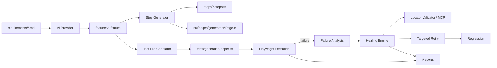

# Architecture

## Pipeline

## Layers

- **src/config** - YAML + env layered configuration, Zod-validated (`ConfigLoader.ts`, `schema.ts`). Nothing else reads `config/*.yaml` or `process.env` directly for framework settings.
- **src/ai** - `AIProvider` interface, `AIClient` (validation + bounded retries), `MockAIProvider` (the only provider that ships). Never trust raw AI output - see [ai.md](./ai.md).
- **src/mcp** - `MCPBrowserProvider` interface + `MCPClient` (typed OK/SKIPPED/ERROR results). No adapter ships - see [mcp.md](./mcp.md).
- **src/bdd** - Requirement parsing, Gherkin generation/parsing/validation, deterministic Step/PageObject/TestFile generators, and the framework's own tiny BDD runtime (`StepRegistry` + `ScenarioRunner`) - no external Cucumber/playwright-bdd dependency.
- **src/locator** - `LocatorDefinition`/strategy priority, `LocatorValidator` (real Playwright-backed validation), `LocatorRanking`, `LocatorDiscovery`.
- **src/healer** - `Healer`/`HealingEngine` (analyze -> candidates -> validate -> targeted retry), `HealingHistory` (JSON store).
- **src/execution** - `TestExecutor` (spawns Playwright), `FailureCollector` (parses Playwright's JSON report), `TargetedRetry`, `RegressionRunner`, `PlaywrightErrorParser`.
- **src/reporting** - Execution/AI/Healing report builders, all consumed by `npm run ai:test` and `npm run report`.
- **src/core** - `ExecutionContext` (executionId + logger), `AiTestPipeline` (the master orchestrator), `FrameworkError`.
- **src/cli** - Commander-based CLI; one file per command under `src/cli/commands/`.

## Key design decisions (and why)

- **No external BDD runner.** Rather than adopting playwright-bdd/cucumber-js, the framework implements its own minimal step registry + scenario runner. This keeps step-matching, healing hooks, and generated-file shape entirely under the framework's control and easy to reason about.
- **AIProvider.suggestLocator returns `AISuggestedLocator[]`, not `LocatorCandidate[]`.** The spec's illustrative interface has AI return `LocatorCandidate[]` directly, but a `LocatorCandidate` carries `validated`/`validationResult` - fields only the *validator* should set. AI proposes; the healer/locator layer validates and promotes a suggestion into a candidate.
- **Locator validation has two independent layers.** `LocatorValidator` (this framework, always available) validates a locator against whatever live Playwright `page` is in hand - existence, uniqueness, visibility, semantic name match. `MCPClient` (optional) is for *discovery* when there is no live page yet, or for richer external inspection (accessibility tree, page structure). Healing during a live test run uses the former; standalone `discover:locators`/`heal` (no live page) fall back to the latter, or SKIP.
- **Healing's "Targeted Retry" is inline, not a second Playwright process.** It replays just the failed action against the *same* live page using the candidate locator, inside `HealingEngine.attemptHeal`. A second full Playwright subprocess run against unpatched source could never pass (the source still calls the original, wrong locator) - that would just be a confusing, dishonest FAIL. `npm run retry:failed` (a real subprocess re-run) remains available for verifying a fix once a human/CI has actually applied it.
